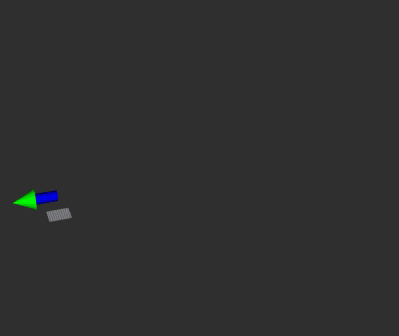

# Kalman Filter Localization
This repository contains two packages:

- `kalman_filter_localization` (ROS2): EKF localization node/component using GNSS/IMU/Odometry.
- `kalman_filter_localization_core` (ROS2-free): header-only EKF core library + unit tests.

## Build
```bash
cd /path/to/ros2_ws
source /opt/ros/humble/setup.bash
colcon build --symlink-install --packages-up-to kalman_filter_localization
```

## Test
```bash
cd /path/to/ros2_ws
source /opt/ros/humble/setup.bash
colcon test --packages-select kalman_filter_localization_core kalman_filter_localization --ctest-args --output-on-failure
```

## Using Core Library
```cpp
#include <kalman_filter_localization/core/ekf.hpp>
```

```cmake
find_package(kalman_filter_localization_core REQUIRED)
target_link_libraries(your_target kalman_filter_localization_core::core)
```

## node
ekf_localization_node
- input  
- ekf_localization/initial_pose (geometry_msgs/PoseStamped)  
- ekf_localization/gnss_pose (geometry_msgs/PoseStamped)  
- ekf_localization/imu (sensor_msgs/Imu)  
- ekf_localization/odom (nav_msgs/Odometry)  
- tf (e.g. base_link (robot frame) -> imu_link (imu frame))  
- output  
- ekf_localization/current_pose (geometry_msgs/PoseStamped)

## params

|Name|Type|Default value|Description|
|---|---|---|---|
|pub_period|int|10|publish period[ms]|
|max_imu_dt_sec|double|0.5|maximum IMU dt accepted by prediction update [s]|
|var_gnss_xy|double|0.1|variance of a gnss receiver about position xy[m^2]|
|var_gnss_z|double|0.15|variance of a gnss receiver about position z[m^2]|
|var_odom_xyz|double|0.2|variance of an odometry[m^2]|
|var_imu_w|double|0.01|variance of an angular velocity sensor[(rad/sec)^2]|
|var_imu_acc|double|0.01|variance of an accelerometer[(m/sec^2)^2]|
|use_gnss|bool|true|whether gnss is used or not |
|use_odom|bool|false|whether odom(lo/vo) is used or not |

## demo

[rosbag demo data(ROS1)](https://drive.google.com/file/d/1CYuip5dApvcF-xrB2f5s8pdBu7MGCDxP/view)

```
rviz2 -d $(ros2 pkg prefix --share kalman_filter_localization)/rviz/ekfl_demo.rviz
```

```
ros2 launch kalman_filter_localization ekf.launch.py
```

```
ros2 topic pub ekf_localization/initial_pose geometry_msgs/PoseStamped '{header: {stamp: {sec: 1532228824, nanosec: 55000000}, frame_id: "map"}, pose: {position: {x: 0, y: 0, z: 10}, orientation: {z: 1, w: 0}}}' --once
```

```
ros2 bag play -s rosbag_v2 test.bag
```


    
blue:initial pose, red:gnss pose, green: fusion pose

## references

- K Feng,"A New Quaternion-Based Kalman Filter",2017
- Joan Solà,"Quaternion kinematics for the error-state Kalman filter",2017
- Daniel Choukroun et al,"A Novel Quaternion Kalman Filter",2006
- An Improved EKF - The Error State Extended Kalman Filter
- Weikun Zhen, Sam Zeng, and Sebastian Scherer. "Robust Localization and Localizability Estimation with a Rotating Laser Scanner" , 2017.
