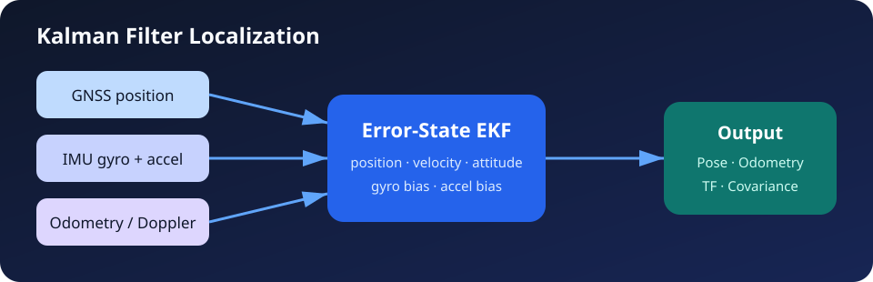
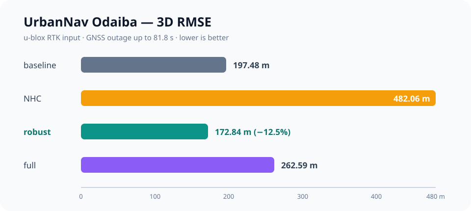

# Kalman Filter Localization

A GNSS/IMU/odometry error-state EKF for ROS 2. It estimates position, velocity,
attitude, and IMU biases.



## Features

- GNSS pose / `NavSatFix` / Doppler velocity
- Gyroscope and accelerometer bias estimation
- GNSS NIS gating and Huber/Cauchy robust losses
- GNSS antenna lever arm and delayed-measurement rewind/replay
- Wheel speed, NHC, ZUPT, and ZIHR
- Continuous-time process noise and second-order discretization
- CSV evaluation and UrbanNav Tokyo ablation tools

## Build and run

```bash
source /opt/ros/$ROS_DISTRO/setup.bash
colcon build --symlink-install
source install/setup.bash
ros2 launch kalman_filter_localization ekf.launch.py
```

Main topics:

| Direction | Topic | Type |
|---|---|---|
| input | `/ekf_localization/initial_pose` | `geometry_msgs/PoseStamped` |
| input | `/gnss_pose` | `geometry_msgs/PoseStamped` |
| input | `/sensing/imu/imu_data` | `sensor_msgs/Imu` |
| input | `/wheel_speed` (optional) | `geometry_msgs/TwistWithCovarianceStamped` |
| output | `/ekf_localization/current_pose` | `geometry_msgs/PoseStamped` |
| output | `/ekf_localization/current_odometry` | `nav_msgs/Odometry` |

See [`ekf.yaml`](kalman_filter_localization_ros2/param/ekf.yaml) for the default
parameters and [`param/profiles`](kalman_filter_localization_ros2/param/profiles) for
dataset-specific configurations.

Select one propagation backend with `propagation_model`:

- `legacy`: frozen historical discretization for regression only.
- `fast`: midpoint nominal integration with second-order `Phi/Qd`.
- `exact`: midpoint integration with Van Loan matrix-exponential `Phi/Qd`, used
  as the offline oracle.

The three old propagation booleans are accepted for one compatibility release
only when they are all false (`legacy`) or all true (`fast`). Mixed or
contradictory settings fail node startup.

## GNSS input

`PoseStamped` is the default input. To use `NavSatFix` directly:

```yaml
gnss_input_type: "navsatfix"
gnss_navsatfix_topic: "/gnss/fix"
gnss_navsatfix_use_first_fix_as_origin: true
gnss_navsatfix_use_position_covariance: true
```

Configure the antenna offset with `gnss_lever_arm_{x,y,z}`. Set
`enable_measurement_replay: true` and choose a positive
`measurement_history_duration_sec` to fuse GNSS, Doppler velocity, wheel, and odometry at their
sensor timestamps while publishing the latest IMU state. The replay engine queues measurements up
to `max_future_measurement_wait_sec` ahead of the latest IMU, rejects farther-future or too-old
measurements, and counts duplicate and reverse stamps. With debug topics enabled,
`/ekf_localization/debug/replay_timing`
reports input source, sensor time, arrival time, filter time, and apply time.

`compensate_gnss_delay` is retained only as a deprecated constant-velocity fallback. It is disabled
automatically when replay is enabled. `gnss_time_offset_sec` also shifts the GNSS replay timestamp.

## Evaluation

```bash
ros2 run kalman_filter_localization evaluate_localization \
  --estimate-csv result.csv \
  --reference-csv ground_truth.csv \
  --output-json metrics.json \
  --output-csv errors.csv
```

CSV files use `stamp,x,y,z,yaw`. The evaluator reports 3D/horizontal/vertical/yaw APE,
time- and distance-indexed RPE, missing ratio, and optional GNSS-outage endpoint drift,
reacquisition overshoot, and settling time. Alignment, interpolation tolerance, time offset, and
evaluation interval are emitted as a machine-readable policy. `evaluate_consistency` summarizes
NEES/NIS means and chi-square 95% coverage from simulation CSV files.

## UrbanNav Tokyo ablation



The Odaiba u-blox RTK solution contains GNSS outages of up to 81.8 seconds. The
wheel-speed + NHC profile reduced outage 3D RMSE from 657.47 m to 3.15 m.

Convert the official CSV files and RTKLIB solution into a ROS 2 bag:

```bash
ros2 run kalman_filter_localization prepare_urbannav_tokyo \
  --imu-csv Odaiba/imu.csv \
  --reference-csv Odaiba/reference.csv \
  --rtklib-pos odaiba_ublox_rtk.pos \
  --output-bag odaiba_input_bag \
  --output-reference-csv odaiba_reference.csv
```

Run selected profiles and generate CSV/Markdown comparisons:

```bash
share="$(ros2 pkg prefix kalman_filter_localization)/share/kalman_filter_localization"
ros2 run kalman_filter_localization run_urbannav_ablation \
  --input-bag odaiba_input_bag \
  --reference-csv odaiba_reference.csv \
  --output-dir results/urbannav_tokyo \
  --base-profile "$share/param/profiles/urbannav_tokyo_tuned.yaml" \
  --profiles-dir "$share/param/profiles" \
  --profile baseline --profile wheel_nhc --profile wheel_nhc_fixed
```

The output contains merged YAML, trajectory CSV, bag, and logs for each profile, plus
`comparison.csv`, `comparison.md`, and `manifest.json`.
See [research evaluation](docs/research_evaluation.md) for the open-sky and outage
protocols, exact intervals, and results.

## Test

```bash
colcon test
colcon test-result --verbose
```

## References

- Joan Sola, *Quaternion kinematics for the error-state Kalman filter*, 2017
- K. Feng, *A New Quaternion-Based Kalman Filter*, 2017
- [UrbanNav Dataset](https://github.com/IPNL-POLYU/UrbanNavDataset)
- [MapIV Eagleye](https://github.com/MapIV/eagleye)
