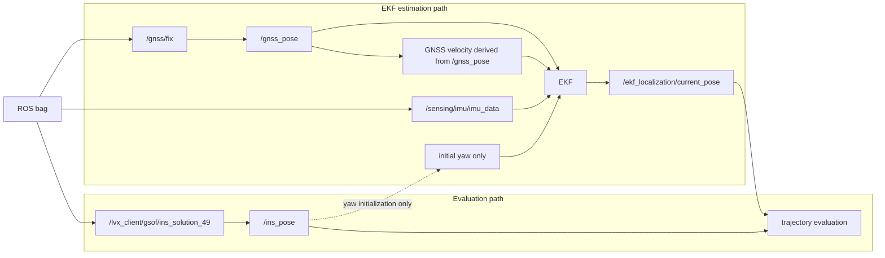
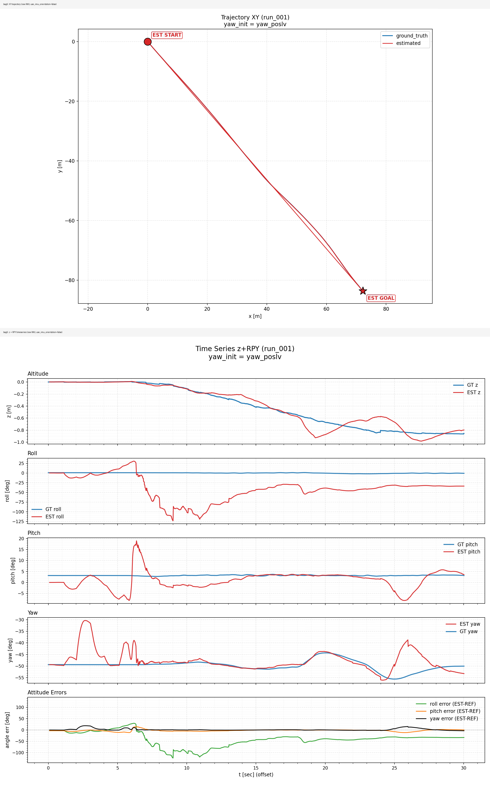

# Kalman Filter Localization

Kalman Filter Localization is a ROS 2 package for 3D localization with GNSS, IMU, and odometry.

## Node
`ekf_localization_node`

Input:
- `/initial_pose` (`geometry_msgs/PoseStamped`)
- `/gnss_pose` (`geometry_msgs/PoseStamped`)
- `/imu` (`sensor_msgs/Imu`)
- `/odom` (`nav_msgs/Odometry`)
- `/tf` (`/base_link` -> `/imu_link`)

Output:
- `/current_pose` (`geometry_msgs/PoseStamped`)

## Params

| Name | Type | Default value | Description |
|---|---|---:|---|
| `pub_period` | int | 10 | Publish period `[ms]` |
| `var_gnss_xy` | double | 0.1 | GNSS position variance in XY `[m^2]` |
| `var_gnss_z` | double | 0.15 | GNSS position variance in Z `[m^2]` |
| `var_odom_xyz` | double | 0.1 | Odometry variance `[m^2]` |
| `var_imu_w` | double | 0.01 | Angular velocity variance `[(deg/sec)^2]` |
| `var_imu_acc` | double | 0.01 | Accelerometer variance `[(m/sec^2)^2]` |
| `use_gnss` | bool | true | Whether GNSS is used |
| `use_odom` | bool | false | Whether odometry is used |

## Istanbul Evaluation

Reference topic depends on the bag contents:
- Bags that contain Applanix `GSOF49 /lvx_client/gsof/ins_solution_49` but no pose topic:
  convert that INS solution to a local ENU pose topic such as `/ins_pose`, then export it as `ground_truth.csv`.
- Bags that already contain `/applanix/lvx_client/odom`:
  use `/applanix/lvx_client/odom` directly as the reference pose.
- For attitude-only reference on those bags:
  use `/applanix/lvx_client/autoware_orientation`.

The table and plots below use the first case: Istanbul open-data bags where reference pose was generated from Applanix POS LVX `GSOF49 /lvx_client/gsof/ins_solution_49` and exported as `ground_truth.csv`.

Dataset links:
- [Istanbul Open Dataset (Autoware Documentation)](https://autowarefoundation.github.io/autoware-documentation/main/datasets/#istanbul-open-dataset)
- [ROS 2 bag folder used for these evaluations](https://drive.google.com/drive/folders/17zXiBeYlM90gQ5hV6EAWaoBTnNFoVPML?usp=drive_link)

Representative run shown below:
- `bag`: `all-sensors-bag5_compressed`
- `initial yaw`: `/ins_pose` yaw only (`yaw_init = yaw_poslv`)
- `imu_topic`: `/sensing/imu/imu_data`
- `use_imu_orientation`: `false`
- `gnss_pose_topic`: `/gnss_pose` converted from `/gnss/fix`
- `use_gnss_velocity`: `true`
- `use_odom`: `false`
- `reference pose`: `/ins_pose`

```mermaid
flowchart LR
  bag["ROS bag"]

  subgraph Estimation["EKF estimation path"]
    gnss_fix["/gnss/fix"]
    gnss_pose["/gnss_pose"]
    gnss_vel["GNSS velocity derived from /gnss_pose"]
    raw_imu["/sensing/imu/imu_data"]
    ekf["EKF"]
    ekf_out["/ekf_localization/current_pose"]
    init_yaw["initial yaw only"]
  end

  subgraph Reference["Evaluation path"]
    gsof49["/lvx_client/gsof/ins_solution_49"]
    ins_pose["/ins_pose"]
    evaluator["trajectory evaluation"]
  end

  bag --> gnss_fix --> gnss_pose --> ekf
  gnss_pose --> gnss_vel --> ekf
  bag --> raw_imu --> ekf
  bag --> gsof49 --> ins_pose
  ins_pose -. yaw initialization only .-> init_yaw --> ekf
  ekf_out --> evaluator
  ekf --> ekf_out
  ins_pose --> evaluator
```

| Run | RMSE 3D [m] | Yaw RMSE [deg] | Notes |
|---|---:|---:|---|
| bag5 representative | 0.105571 | 4.872169 | POSLV yaw init only, raw IMU used, IMU orientation fusion disabled |

Representative single-bag comparison for `bag5`:

## References

- K Feng, "A New Quaternion-Based Kalman Filter", 2017
- Joan Sola, "Quaternion kinematics for the error-state Kalman filter", 2017
- Daniel Choukroun et al, "A Novel Quaternion Kalman Filter", 2006
- "An Improved EKF - The Error State Extended Kalman Filter"
- Weikun Zhen, Sam Zeng, and Sebastian Scherer, "Robust Localization and Localizability Estimation with a Rotating Laser Scanner", 2017
