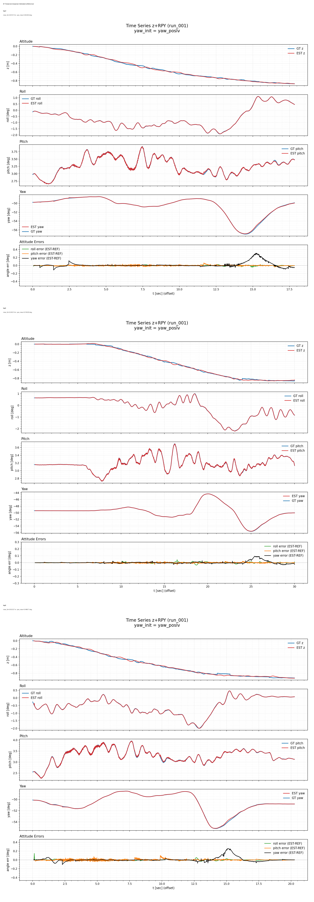

# Kalman Filter Localization

Kalman Filter Localization is a ROS 2 package for 3D localization with GNSS, IMU, and odometry.

## Node
`ekf_localization_node`

Input:
- `/initial_pose` (`geometry_msgs/PoseStamped`)
- `/gnss_pose` (`geometry_msgs/PoseStamped`)
- `/imu` (`sensor_msgs/Imu`)
- `/odom` (`nav_msgs/Odometry`)
- `/tf` (`/base_link` -> `/imu_link`)

Output:
- `/current_pose` (`geometry_msgs/PoseStamped`)

## Params

| Name | Type | Default value | Description |
|---|---|---:|---|
| `pub_period` | int | 10 | Publish period `[ms]` |
| `var_gnss_xy` | double | 0.1 | GNSS position variance in XY `[m^2]` |
| `var_gnss_z` | double | 0.15 | GNSS position variance in Z `[m^2]` |
| `var_odom_xyz` | double | 0.1 | Odometry variance `[m^2]` |
| `var_imu_w` | double | 0.01 | Angular velocity variance `[(deg/sec)^2]` |
| `var_imu_acc` | double | 0.01 | Accelerometer variance `[(m/sec^2)^2]` |
| `use_gnss` | bool | true | Whether GNSS is used |
| `use_odom` | bool | false | Whether odometry is used |

## Istanbul Evaluation

Latest Istanbul split used for validation:
- `bag1-3`: shared profile
- `bag4`: `kalman_filter_localization_ros2/param/profiles/istanbul_all_sensors_bag4.yaml`
- `bag5-6`: `kalman_filter_localization_ros2/param/profiles/istanbul_all_sensors_bag5_6.yaml`

GT pose in the table and plot means the reference trajectory from the bag topic `/ins_pose`, exported as `ground_truth.csv` during validation.

| Bag | Profile | RMSE 3D [m] | Yaw RMSE [deg] |
|---|---|---:|---:|
| bag4 | `istanbul_all_sensors_bag4.yaml` | 0.091574 | 0.064264 |
| bag5 | `istanbul_all_sensors_bag5_6.yaml` | 0.043214 | 0.019029 |
| bag6 | `istanbul_all_sensors_bag5_6.yaml` | 0.052227 | 0.048671 |

Note: `bag4` still shows larger run-to-run variance than `bag5-6`.

## References

- K Feng, "A New Quaternion-Based Kalman Filter", 2017
- Joan Sola, "Quaternion kinematics for the error-state Kalman filter", 2017
- Daniel Choukroun et al, "A Novel Quaternion Kalman Filter", 2006
- "An Improved EKF - The Error State Extended Kalman Filter"
- Weikun Zhen, Sam Zeng, and Sebastian Scherer, "Robust Localization and Localizability Estimation with a Rotating Laser Scanner", 2017
