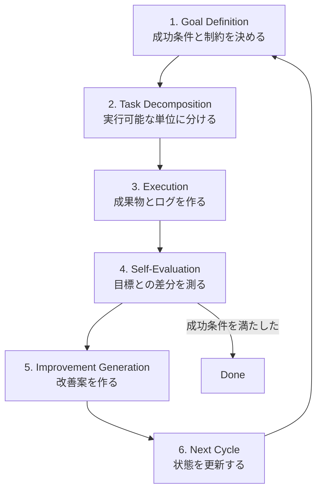

# エージェント設計の基本: 自動改善ループ

## 概要
エージェントを単発実行ではなく、継続的に精度と速度を上げるループとして設計する。
各サイクルで「目標」「実行」「評価」「改善」を明示し、次の一手を小さく更新する。

## ループ全体像


## 6ステップ
1. ゴール定義
   何を達成するか、成功条件、制約、期限を明確化する。
2. タスク分解
   ゴールを実行可能な単位に分割し、優先順位を付ける。
3. 実行
   分解したタスクを順番に処理し、成果物を生成する。
4. 自己評価
   成果物を成功条件と比較し、差分と失敗原因を特定する。
5. 改善案生成
   差分を埋める修正案を列挙し、次に試す案を決める。
6. 次サイクル
   状態を更新し、再び `1. ゴール定義` に戻る。

## 実行テンプレート
| ステップ | 入力 | 出力 |
| --- | --- | --- |
| 1. ゴール定義 | 要求、制約、期限 | 明文化された目標と完了条件 |
| 2. タスク分解 | 目標、現在状態 | 優先度付きタスクリスト |
| 3. 実行 | タスクリスト | 中間成果物、ログ、計測値 |
| 4. 自己評価 | 成果物、完了条件 | ギャップ一覧、原因仮説 |
| 5. 改善案生成 | ギャップ一覧、原因仮説 | 修正案、次アクション |
| 6. 次サイクル | 修正案、更新済み状態 | 次ループの開始条件 |

## 擬似コード
```text
state = initialize()
while not done(state):
    goal = define_goal(state)
    tasks = decompose(goal, state)
    artifacts = execute(tasks, state)
    gaps = self_evaluate(artifacts, goal, state)
    improvements = generate_improvements(gaps, state)
    state = update_state(state, artifacts, gaps, improvements)
```

## 設計原則
- 成功条件を数値化する。`良くなった気がする` ではなく `rmse_3d を 10% 改善` のように定義する。
- 1サイクルで変える変数を絞る。原因と結果の対応を追える状態を保つ。
- 実行ログを残す。あとから比較できない改善は再現性がない。
- 改善案は複数作るが、次に試す案は少数に絞る。
- ループ時間を短く保つ。大きな一発変更より、小さな検証を早く回す。

## 汎用チェックリスト
- `Goal` は数値または判定可能な条件になっているか
- `Baseline` は保存されているか
- `Changes` はファイル名とパラメータ差分まで追えるか
- `Result` は成功条件に対して比較可能か
- `Issue` は次回の仮説につながる粒度で残っているか
- `Next` は次サイクルで実行できる粒度に落ちているか

## サイクル記録テンプレート
サイクル単位の記録には [cycle_log_template.md](cycle_log_template.md) を使う。

最低限、毎回残す項目は以下の5つ。

- `Goal`: 今回の達成条件
- `Changes`: 変更したファイル、パラメータ、コマンド
- `Result`: 指標、成功/失敗、主要ログ
- `Issue`: 想定外の挙動、警告、失敗原因
- `Next`: 次に試すアクションを3件以内

## このワークスペースへの適用
対象パッケージは `kalman_filter_localization`。
主な入力は `/gnss/fix`、`/lvx_client/gsof/ins_solution_49`、`/sensing/imu/imu_data`。
評価は `tools/run_open_data_sweep.py` と `tools/run_istanbul_suite.py` を中心に回す。

## このワークスペースでの評価軸
- 主指標: `rmse_3d`
- 補助指標: `rmse_3d_nobias`, yaw 誤差
- 安定性指標: `non-positive IMU dt` や TF 警告の発生有無
- 再現性指標: 同じ bag と設定で同傾向の結果が出るか

## 現在の優先タスク
1. 起動安定化
   `ekf.launch.py` の TF 設定と入力トピック経路を固定し、警告を減らす。
2. 時刻整合
   `tools/gsof49_to_imu.py` で IMU 時刻を単調化し、`non-positive IMU dt` を抑制する。
3. ベースライン計測
   Istanbul bag で `run_open_data_sweep.py` を実行し、`summary.csv` を保存する。
4. パラメータ改善
   `param_grid_istanbul_quick.json` を起点に上位設定を再試行する。
5. レポート化
   `open_data_report_*.html` と `ranking_by_rmse_3d*.csv` で改善率を追跡する。

## 6ステップを実タスクへ対応
| ステップ | このWSで実施すること | 完了条件 |
| --- | --- | --- |
| 1. ゴール定義 | 例: `Istanbul bag で基準 run 比 rmse_3d を 10% 以上改善` | 指標と比較対象が明文化されている |
| 2. タスク分解 | 変換ノード、EKF 起動、sweep 実行、結果抽出に分割 | 1サイクル分の実行順が決まっている |
| 3. 実行 | `run_open_data_sweep.py` を 1 バッチ回す | `summary.csv` と report が生成される |
| 4. 自己評価 | 上位 N 件の `rmse_3d`, `rmse_3d_nobias`, yaw 誤差を確認 | 改善または悪化の理由仮説が 1 つ以上ある |
| 5. 改善案生成 | ノイズ共分散、`max_imu_dt_sec`、入力トピックを調整案化 | 次サイクルの変更点が 3 件以内に絞られる |
| 6. 次サイクル | 変更を反映して再実行 | 新旧比較表が更新される |

## 1サイクル実行例
```bash
cd gnssimu_kf_ros2_ws
source /opt/ros/humble/setup.bash
source install/setup.bash

ROS_LOG_DIR=/tmp/ros2_logs python3 src/kalman_filter_localization/tools/run_open_data_sweep.py \
  --bag-path data/istanbul/all-sensors-bag1_compressed \
  --param-grid-json src/kalman_filter_localization/tools/param_grid_istanbul_quick.json \
  --output-dir /tmp/kfl_cycle01 \
  --imu-topic /ins_imu \
  --gnss-topic /gnss_pose \
  --ground-truth-topic /ins_pose \
  --play-topics /sensing/imu/imu_data /gnss/fix /lvx_client/gsof/ins_solution_49 \
  --enable-navsatfix-to-pose \
  --navsatfix-input-topic /gnss/fix \
  --navsatfix-output-topic /gnss_pose \
  --enable-applanix-to-pose \
  --applanix-input-topic /lvx_client/gsof/ins_solution_49 \
  --applanix-output-topic /ins_pose \
  --applanix-origin-navsatfix-topic /gnss/fix \
  --enable-applanix-to-imu \
  --applanix-imu-output-topic /ins_imu \
  --applanix-imu-output-mode ros \
  --initial-yaw-source-topic /ins_pose \
  --initial-yaw-source-msg-type pose_stamped \
  --initial-yaw-timeout-sec 20.0
```

## KF性能レポートの自動更新
`summary.csv` から [agent_design_loop_report.html](agent_design_loop_report.html) の
`Latest Metrics (Auto)` セクションを更新できる。複数 `summary.csv` を渡すと、
サイクル比較ダッシュボードになる。

```bash
cd gnssimu_kf_ros2_ws
python3 src/kalman_filter_localization/tools/update_agent_design_loop_report.py \
  --summary-csv src/kalman_filter_localization/docs/results/open_data/istanbul_bag1_course_yaw/summary.csv \
  --summary-csv src/kalman_filter_localization/docs/results/open_data/istanbul_bag3_course_yaw/summary.csv
```

## 1コマンドで1サイクル実行
`run_open_data_sweep.py` 実行後に HTML レポート更新まで自動で行う。

```bash
cd gnssimu_kf_ros2_ws
src/kalman_filter_localization/tools/run_agent_cycle.sh \
  data/istanbul/all-sensors-bag1_compressed \
  /tmp/kfl_cycle01 \
  src/kalman_filter_localization/tools/param_grid_istanbul_quick.json \
  cycle01 \
  src/kalman_filter_localization/docs/results/agent_loop_summary_paths.txt
```

`agent_loop_summary_paths.txt` に `summary.csv` パスが蓄積され、次回以降の実行で
複数サイクル比較が自動更新される。
