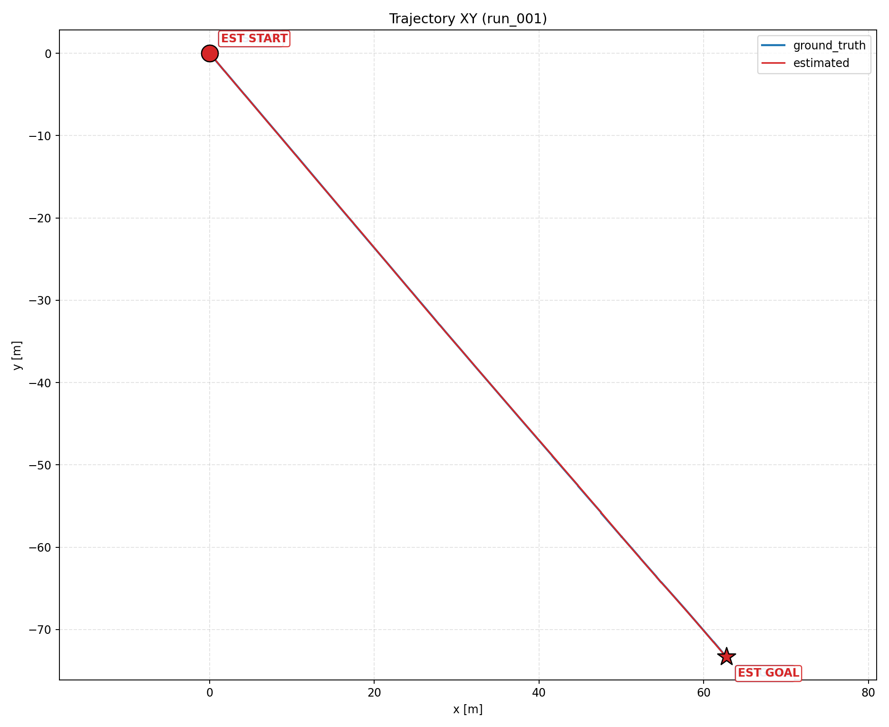
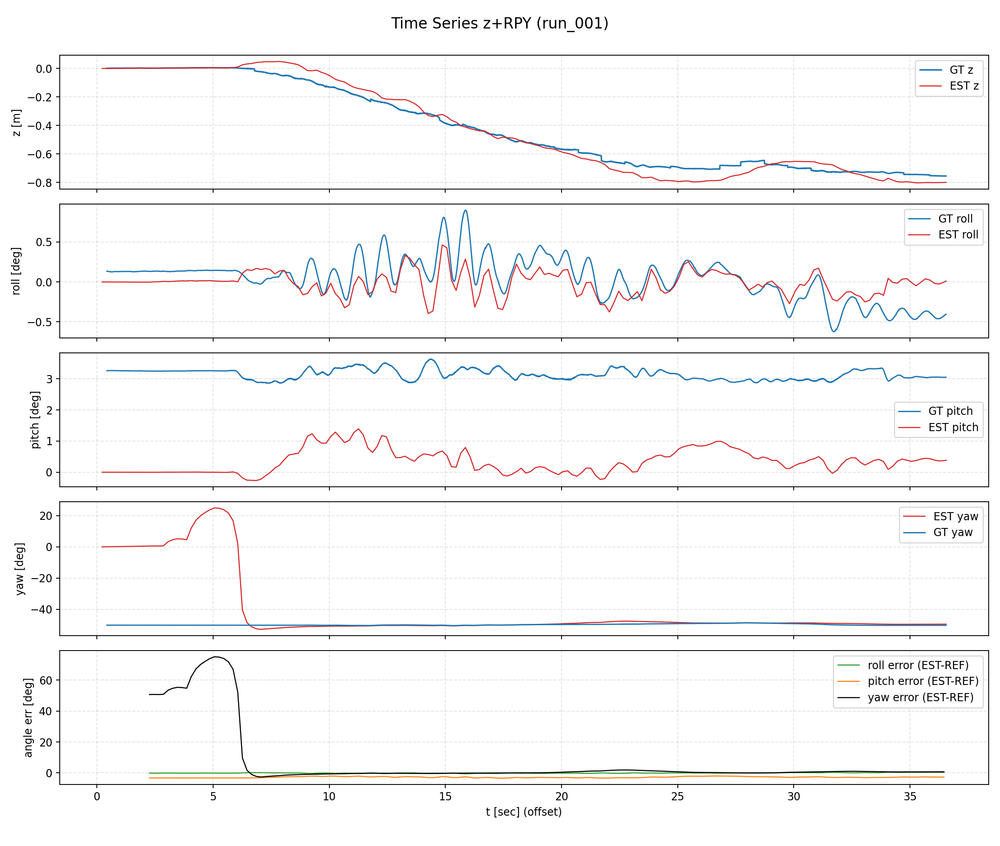
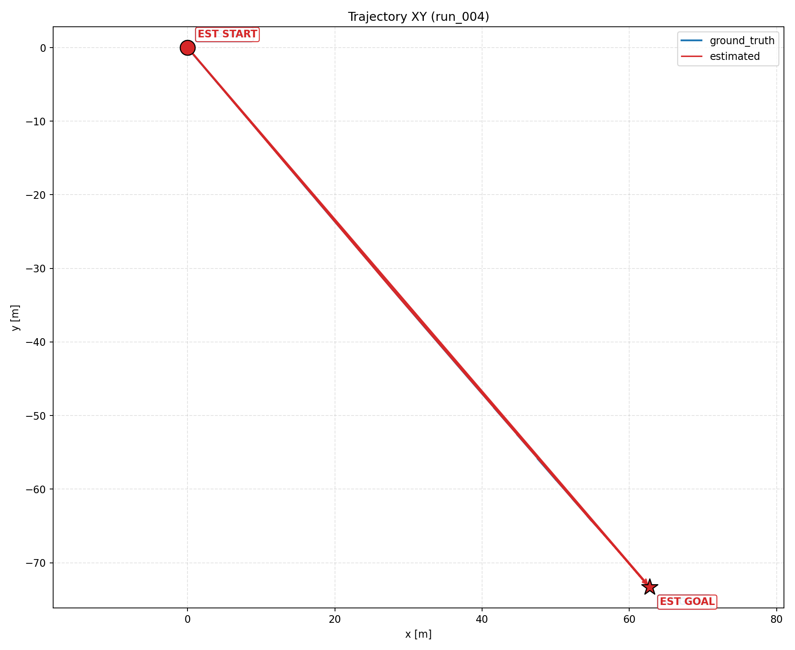
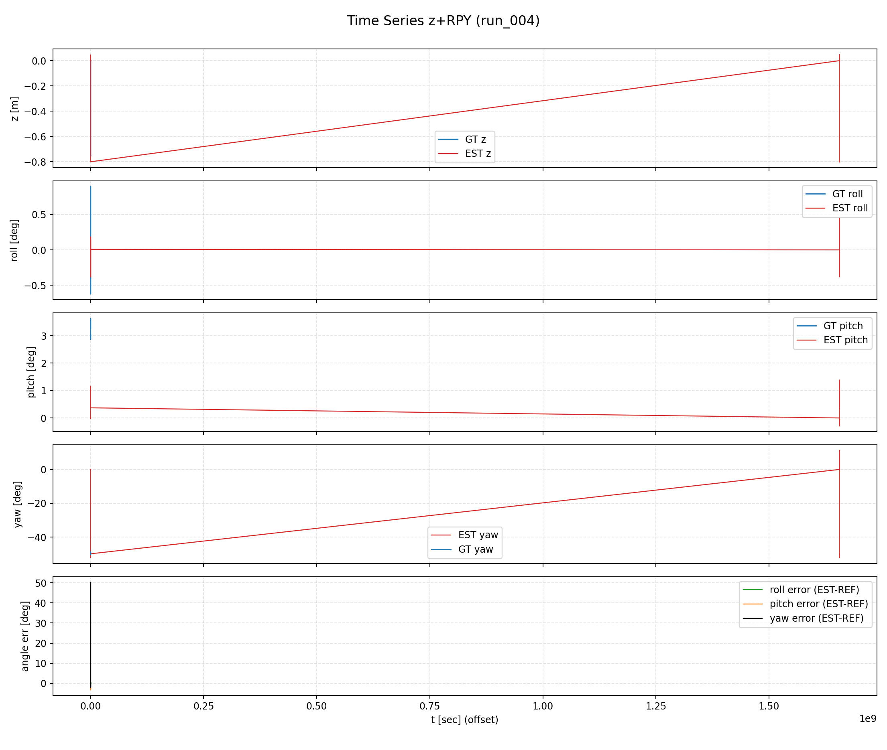

# Open Data Results

## Istanbul `all-sensors-bag1_uncompressed` (snapshot)

Results here are generated from `run_open_data_sweep.py`/suite runs and stored in this repository so they can be referenced from docs without re-running.

- Snapshot date: 2026-02-17
- Run source: `/tmp/kfl_istanbul_suite_course_yaw/...` and `/tmp/kfl_flat_ground_suite_20260217/...`

### Course-yaw tuning case (GNSS course yaw enabled)

| Metric | Value |
| --- | --- |
| RMSE 3D [m] | 0.06496 |
| RMSE XY [m] | 0.03634 |
| RMSE 3D (no bias) [m] | 0.06136 |
| Bias Z [m] | -0.00432 |
| Attitude angle RMSE [deg] | 21.56 |
| Roll RMSE [deg] | 0.22 |
| Pitch RMSE [deg] | 2.80 |
| Yaw RMSE [deg] | 21.38 |
| Best run id | `run_001` |
| Reference | `gt_quat` |

**Best parameters (run_001)**  
`use_flat_ground = true`, `use_imu_orientation = false`, `use_gnss_course_yaw = true`,  
`var_gnss_course_yaw = 0.05`, `var_gnss_xy = 0.05`, `var_gnss_z = 0.1`, `var_imu_w = 0.005`, `var_imu_acc = 0.01`





- [summary.csv](results/open_data/istanbul_bag1_course_yaw/summary.csv)
- [ranking_by_rmse_3d.csv](results/open_data/istanbul_bag1_course_yaw/ranking_by_rmse_3d.csv)
- [suite_summary.csv](results/open_data/istanbul_bag1_course_yaw/suite_summary.csv)

### Flat-ground tuning case (GNSS course yaw off)

| Metric | Value |
| --- | --- |
| RMSE 3D [m] | 0.04817 |
| RMSE XY [m] | 0.01647 |
| RMSE 3D (no bias) [m] | 0.02408 |
| Bias Z [m] | -0.0411 |
| Attitude angle RMSE [deg] | 4.86 |
| Roll RMSE [deg] | 0.40 |
| Pitch RMSE [deg] | 2.69 |
| Yaw RMSE [deg] | 4.03 |
| Best run id | `run_004` |
| Reference | `gt_quat` |

**Best parameters (run_004)**  
`use_flat_ground = true`, `use_imu_orientation = false`, `use_gnss_course_yaw = false`,  
`var_gnss_xy = 0.2`, `var_gnss_z = 0.1`, `var_imu_w = 0.005`, `var_imu_acc = 0.01`





- [suite_summary.csv](results/open_data/istanbul_bag1_flat_ground/suite_summary.csv)
- [run_summary.csv](results/open_data/istanbul_bag1_flat_ground/run_summary.csv)
- [ranking_by_rmse_3d.csv](results/open_data/istanbul_bag1_flat_ground/ranking_by_rmse_3d.csv)

## Reproduce from scratch

```bash
source /opt/ros/humble/setup.bash
source install/setup.bash

python3 src/kalman_filter_localization/tools/run_open_data_sweep.py \
  --bag-path data/istanbul/all-sensors-bag1_uncompressed \
  --param-grid-json src/kalman_filter_localization/tools/param_grid_istanbul_quick.json \
  --output-dir /tmp/kfl_open_data_bag1_demo \
  --ground-truth-topic /ins_pose \
  --imu-topic /sensing/imu/imu_data \
  --gnss-topic /gnss_pose \
  --play-topics /sensing/imu/imu_data /gnss/fix /lvx_client/gsof/ins_solution_49
```

The produced files are:
- `summary.csv`
- `ranking_by_rmse_3d.csv`
- `ranking_by_rmse_3d_nobias.csv`
- `open_data_sweep_report_*.html`
- `best_plots/*`

Copy them into `docs/results/open_data/<case>/` if you want to publish in the repository.
